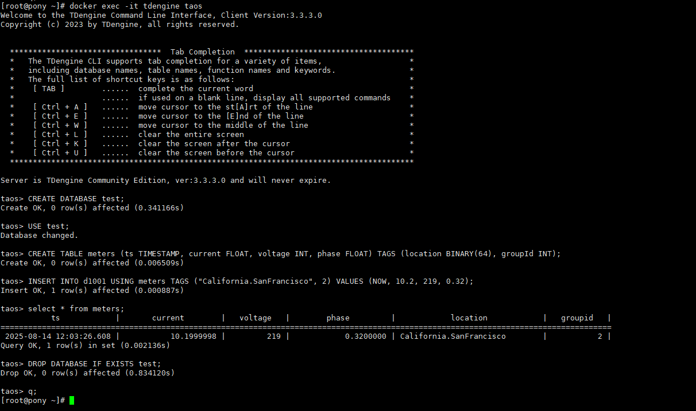

# TDengine数据库使用指南

# 一、商品链接

[TDengine数据库](https://marketplace.huaweicloud.com/hidden/contents/19146527-8825-4046-ae72-d6856cf22d10#productid=OFFI1166672139135340544)

# 二、商品说明

TDengine TSDB 是一款 开源、高性能、云原生 的时序数据库（Time Series Database, TSDB）, 它专为物联网、车联网、工业互联网、金融、IT 运维等场景优化设计。同时它还带有内建的缓存、流式计算、数据订阅等系统功能，能大幅减少系统设计的复杂度，降低研发和运营成本，是一款极简的时序数据处理平台。本商品基于鲲鹏服务器的Huawei Cloud EulerOS 2.0 64bit系统，提供开箱即用的TDengine数据可视化平台。

# 三、商品购买

您可以在云商店搜索 **TDengine数据库**。

其中，地域、规格、推荐配置使用默认，购买方式根据您的需求选择按需/按月/按年，短期使用推荐按需，长期使用推荐按月/按年，确认配置后点击“立即购买”。

# 3.1ECS 控制台配置

### 准备工作

在使用ECS控制台配置前，需要您提前配置好 **安全组规则**。

> **安全组规则的配置如下：**
> - 入方向规则放通端口6030、6041、6043、6044-6049、6060，源地址内必须包含您的客户端ip，否则无法访问
> - 入方向规则放通 CloudShell 连接实例使用的端口 `22`，以便在控制台登录调试
> - 出方向规则一键放通

### 创建ECS

前提工作准备好后，选择 ECS 控制台配置跳转到[购买ECS](https://support.huaweicloud.com/qs-ecs/ecs_01_0103.html) 页面，ECS 资源的配置如下图所示：

选择CPU架构

选择服务器规格

选择镜像

其他参数根据实际请客进行填写，填写完成之后，点击立即购买即可


> **值得注意的是：**
> - VPC 您可以自行创建
> - 安全组选择 [**准备工作**](#准备工作) 中配置的安全组；
> - 弹性公网IP选择现在购买，推荐选择“按流量计费”，带宽大小可设置为5Mbit/s；
> - 高级配置需要在高级选项支持注入自定义数据，所以登录凭证不能选择“密码”，选择创建后设置；
> - 其余默认或按规则填写即可。

# 商品使用

## TDengine数据库使用

### 使用taos shell连接‌测试
执行以下命令，连接
```bash
docker exec -it tdengine taos
```

在tdengine 命令行内执行
```bash
CREATE DATABASE test;  -- 创建测试库
USE test;
CREATE TABLE meters (ts TIMESTAMP, current FLOAT, voltage INT, phase FLOAT) TAGS (location BINARY(64), groupId INT);  -- 建表测试写入权限
INSERT INTO d1001 USING meters TAGS ("California.SanFrancisco", 2) VALUES (NOW, 10.2, 219, 0.32);  -- 数据写入测试
```

### 参考文档
[TDengine官方文档](https://docs.taosdata.com/)
